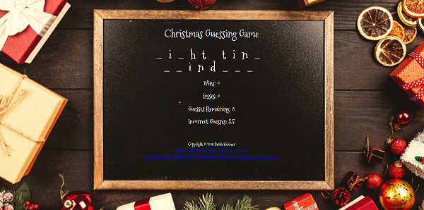

# Word-Guess-Game
A word guessing (or hangman-stlye) game created with Vanilla JavaScript, HTML5, and CSS3.

## Developed by: Sarah Kinneer
## November/December, 2018

## Technologies Used:
Vanilla JavaScript, HTML5, CSS3, Google Fonts

## Link to Live Site:
- [Play the Game!](https://kinneers.github.io/word-guess-game) - Head to the live site for some fun!

## To Use the Live Site:
This application requires a keyboard.
- Press any key to begin the game
- Guess a letter by pressing a letter key on the keyboard: If you guess correctly the letter will display on the screen and you will hear sleigh bells ringing.  If you guess incorrectly, you will hear a snowball splat and you remaining guesses will decrease by one.
- If you guess the word before running out of guesses you will get a win and a new round will automatically begin.
- If you run out of guesses you will get a loss and a new round will automatically begin.

## Photograph and Sound Sources:
Many thanks to George Dolgikh on Pexels and for a beautiful, free stock image!
Much gratitude to Mike Koenig from SoundBible.com for sound effects (Creative Commons Attribution 3.0)!
